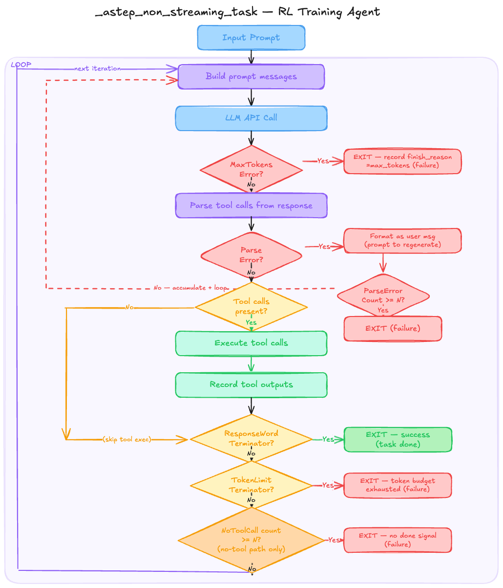

# Training agent

Different design of agent

! TODO: check apply chat template

## TITO training agent

**Turn 1**

[prompt_1]

[prompt_1] [response_1] 

[prompt_1] [response_1] [tool_result_1]

**Turn 2**

[prompt_1] [response_1] [tool_result_1]

[prompt_1] [response_1] [tool_result_1] [response_2]

[prompt_1] [response_1] [tool_result_1] [response_2] [tool_result_1]

## Turn-level training agent, with only tool call maintained in context
**Turn 1**

[prompt_1]

[prompt_1] [response_1]

[prompt_1] [tool_call_1] [tool_result_1]

**Turn 2** prune content and thinking only keep the tool call in context

[prompt_1] [tool_call_1] [tool_result_1]

[prompt_1] [tool_call_1] [tool_result_1] [response_2]

[prompt_1] [tool_call_1] [tool_result_1] [tool_call_2] [tool_result_1]

## Turn-level training agent, with only tool call maintained in context, plus context management
**Turn 1**

[prompt_1] [tool_call_1] [tool_result_1]

[prompt_1] [tool_call_1] [tool_result_1] [response_2]

[prompt_1] [tool_call_1] [tool_result_1] [tool_call_2] [tool_result_2]

.
.
.

**Turn N**

[prompt_N-i] [tool_call_N-i] [tool_result_N-i] ... [tool_call_N-1] [tool_result_N-1]

[prompt_N-i] [tool_call_N-i] [tool_result_N-i] ... [tool_call_N-1] [tool_result_N-1] [response_N]

[prompt_N-i] [tool_call_N-i] [tool_result_N-i] ... [tool_call_N-1] [tool_result_N-1] [tool_call_N] [tool_result_N]

```
messages = [
  {"role": "user", "content": "prompt"},
  {"role": "assistant", "content": "response1"},  # Already generated!
  {"role": "tool", "content": "tool_result"}
]
```

help me draw a diagram capture _astep_non_streaming_task to aid the design for error handling etc. for RL training. 

the agent starts with a input prompt.
then enter the loop

it'll starts with getting prompt and then get the response, here an error maybe captured if the client encounter exceeding max output token problem.
then it will carry out a few checks from the response. including tool call parsing error. the tool call parsing error will be formatted as a user message format to prompt the model to regenerate. but here's not the point of continue yet. 

after a few checking, tool calls will be made and the tool output will be recorded.

after that TokenLimitTerminator, and ResponseWordTerminator will be checked to decide whether to return 

if there's no tool call, no tool call parse error, and the terminator hasn't been triggered, then we return the user prompt to model in the next iteration.

the returned and recorded to the model should be the addition of all above output.

the purpose of the design is to explicit tool call output and accurate error tracking. but the order of these operations might need to be optimized. 

